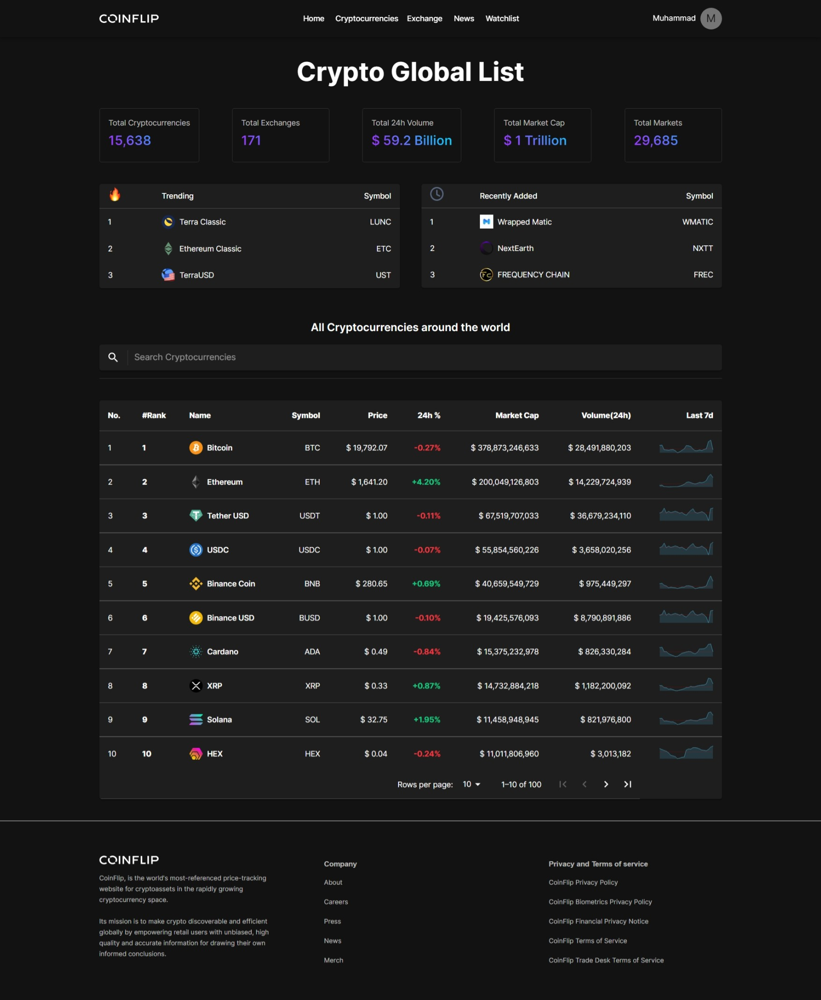
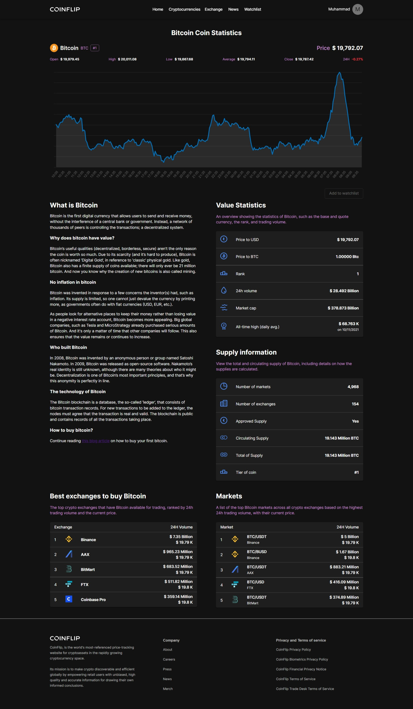

# Coinflip Crypto Tracker - DTS Final Project

Aplikasi untuk memantau nilai tukar kripto terkini berdasarkan data dari third-party API. User dapat membuat list mata uang kripto yang ingin di-track dan memantau perubahan nilai tukar. 

Aplikasi ini dibuat untuk memenuhi tugas akhir pelatihan Digitalent Scholarship Proffesional Academy 2022 Batch 2. React Developer Class.

<br/>

## Project Status

Project masih dalam tahap pengembangan. namun sudah dapat digunakan untuk memantau nilai tukar kripto. User juga dapat melakukan sign up dan login untuk menyimpan list mata uang kripto yang ingin di-track.

<br/>

## Project Screen Shot(s)

<div align="center">

<figure>
  
  <figcaption>
  Landing Page 
  <a href="https://coinflip-tracker.netlify.app/">(Live Demo)</a>
  </figcaption>
</figure>

<br/>
<br/>

<figure>
  
  <figcaption>
  Cyptolist Page
  <a href="https://coinflip-tracker.netlify.app/cryptocurrencies/">(Live Demo)</a>
</figcaption>

<br/>
<br/>

<figure>
  
  <figcaption>
  Bitcoin Details Page
  <a href="https://coinflip-tracker.netlify.app/cryptocurrencies/details/Qwsogvtv82FCd">(Live Demo)</a>
</figcaption>

</div>

<br/>

## Installation and Setup Instructions 

Clone down this repository. You will need `node` and `npm` installed globally on your machine.  

Installation:

```bash
npm install
```  

To Run Test Suite:  

```bash
npm test
```  

To Start Server:

```bash
npm start
```  

To Visit Development App:

http://localhost:3000/

<br/>

## Demo Link

You can see the demo of this project here:

https://coinflip-tracker.netlify.app/

make sure to use the latest version of your browser. and also have fake email ready for sign up and login.

<br/>

## Tech Stack

#### Core Tech Stack:
- [React](https://reactjs.org/)
- [Redux](https://redux.js.org/)
- [Redux Toolkit](https://redux-toolkit.js.org/)
- [React Router](https://reactrouter.com/)

#### Styling & data visualization:
- [Material-ui](https://material-ui.com/)
- [React-chartjs-2](https://react-chartjs-2.js.org/)

#### Utility Tech Stack:
- [Millify](https://www.npmjs.com/package/millify)
- [Sparkline](https://www.npmjs.com/package/react-sparklines)
- [dayjs](https://day.js.org/)


#### Backend and Authentication:
- [Apollo Client](https://www.apollographql.com/docs/react/)
- [Hasura](https://hasura.io/)
- [Firebase](https://firebase.google.com/)

#### Deployment:
- [Netlify](https://www.netlify.com/)

